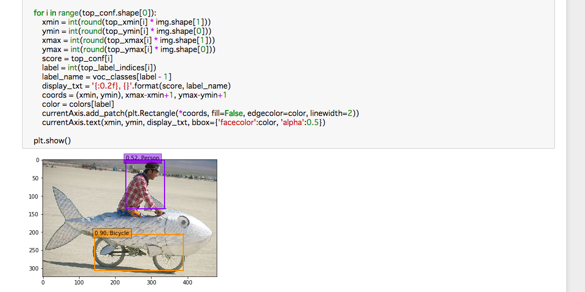

# Detection model(SSD) prediction
* 参考: 「SSD: Single Shot MultiBox Detector 高速リアルタイム物体検出デモをKerasで試す」(https://qiita.com/PonDad/items/6f9e6d9397951cadc6be)

## libgccのコピー(結果的には不要)
cv2をインポートする際に
```shell
ImportError: /home/ubuntu/anaconda3/envs/tensorflow_p36/bin/../lib/libstdc++.so.6: version `CXXABI_1.3.8' not found (required by /home/ubuntu/anaconda3/envs/tensorflow_p36/lib/python3.6/site-packages/../../././libicui18n.so.58)
```
と出るのでlibstdc++をコピーしておく。
```shell
$ cp /usr/lib/x86_64-linux-gnu/libstdc++.so.6 /home/ubuntu/anaconda3/envs/tensorflow_p36/lib
```

```shell
$ source activate tensorflow_p36
$ python
>>> import cv2
```
でエラーがでないことを確認する。

## SSDのKeras実装をダウンロード(結果的には不要)
```shell
$ cd
$ git clone https://github.com/rykov8/ssd_keras.git
```

## 学習済みモデルのダウンロード(結果的には不要)
学習済みモデルが
https://mega.nz/#F!7RowVLCL!q3cEVRK9jyOSB9el3SssIA
に公開されているので「weights_SSD300.hdf5
」をダウンロードし、ssd_kerasディレクトリに保存する。
```shell
$ cd
$ cd ssd_keras
$ unzip SSD.zip
$ mv SSD/weights_SSD300.hdf5 .
```
## Jupyter notebookの起動

* すでにJupyter notebookが起動済みの場合は終了する
```shell
$ ps -ef | grep jupyter
$ kill (プロセスID)
```

* ssd_kerasをホームディレクトリにしてJupyter notebookを起動する
```shell
$ cd
$ cd ssd_keras
$ jupyter notebook
```

## Keras2用にスクリプトを修正
### 修正版ssd.py（うまくいかず）
* 公開されているSSDのKeras実装はKeras2非対応なので
https://gist.github.com/anonymous/4c3105119a233cb33926651c3ea1966c
から修正版のssd.pyをダウンロードし、差し替える。

* ssd_layers.pyの
```python
    def get_output_shape_for(self, input_shape):
```
を
```python
    def compute_output_shape(self, input_shape):
```
に変更する。

* model.predictでエラーがでる


### cory8249版（うまくいかず）
* Keras2に対応したpull request
https://github.com/cory8249/ssd_keras.git
をclone
* test_ssd.pyを実行してみたがやはりmodel.predictでエラー

### wikke版
* Keras2に対応した修正版
https://github.com/wikke/SSD_Keras.git
をclone
* ディレクトリに移ってJupyter notebookを起動
```shell
$ cd SSD_Keras/
$ jupyter notebook
```
* SSD.ipynbを開いてKernel -> Change Kernel -> Environment(conda_tensorflow_p36)を選択する
* pydotをインストール
```shell
$ conda install pydot
```
* VOCdevkit(datasetのダウンロード)
```shell
$ wget http://host.robots.ox.ac.uk/pascal/VOC/voc2007/VOCtrainval_06-Nov-2007.tar
$ tar -xvf VOCtrainval_06-Nov-2007.tar
```
### wikke版で学習から行う場合（オプション）
```python
RUN = RUN + 1 if 'RUN' in locals() else 1
```
から始まるセルを実行すると学習から始まる。
* ログ出力先のパーミッションがないと言われるのでログ出力先を変更
```python
LOG_DIR = '/output/training_logs/run{}'.format(RUN)
```
```python
LOG_DIR = '/tmp/training_logs/run{}'.format(RUN)
```

* Tensorboardで確認
```shell
$ tensorboard --logdir=(LOG_DIRのパス)
```
### wikke版で学習済モデルを使う場合
学習済みのウェイトが公開されている。
https://drive.google.com/file/d/0B5o_TPhUdyJWWEl5WG1lcUxCZzQ/view
* いったんクライアント側でモデルファイルをダウンロードしscpでコピーする
```shell
$ scp -i /Users/(ユーザ名)/.ssh/(キーペア名).pem ~/Downloads/PASCAL_VOC_SSD300_weight_checkpoint-epoch-16-loss-3.3392.hdf5 ubuntu@ec2-54-92-24-33.ap-northeast-1.compute.amazonaws.com:/home/ubuntu
```
* モデルファイルをSSD_Kerasディレクトリに移動
* モデルロード、推論を実行
```python
model.load_weights('./PASCAL_VOC_SSD300_weight_checkpoint-epoch-16-loss-3.3392.hdf5', by_name=True)
```
以降を実行。
* detectionの実行結果を確認


## Notebookの作成
* Jupyter notebookの「New」から「Environment(conda_tensorflow_p36)」を選択する
* 適当な名前(SSD_predictionなど)をつける
* 画像をサーバ側に移しておく
* 基本はSSD.ipynbを踏襲し、モデル構造の画像出力やモデル学習を除く

