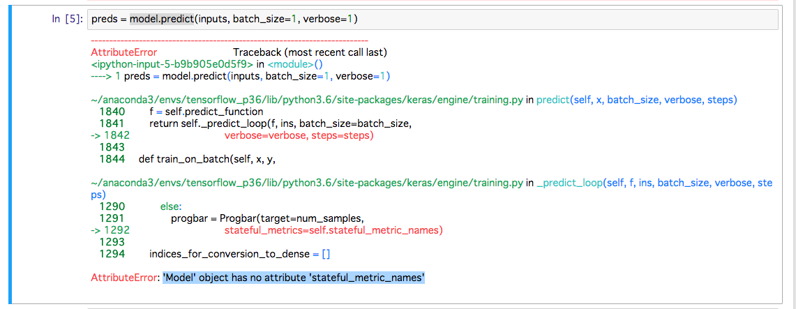
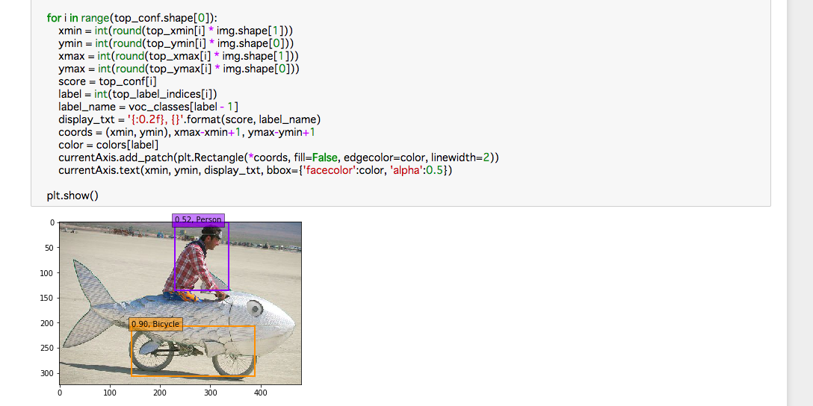

# Segmentation model(FCN) prediction

## インストール
* python2が前提になっていることに注意
### keras-contrib for DenseNet based model
```shell
$ source activate tensorflow_p27
$ git clone https://github.com/ahundt/keras-contrib.git -b densenet-atrous
$ cd keras-contrib
$ sudo python setup.py install
```

### MS COCO API
* Keras-FCNのREADME.mdのパスは誤っている
* 「Microsoft COCO が提供するデータとAPIを使用すると画像解析が簡単に出来た」(https://qiita.com/GushiSnow/items/5a4948e07e3f4a77d895)を参考
```shell
$ cd ..
$ git clone https://github.com/cocodataset/cocoapi.git
$ cd cocoapi/PythonAPI
$ conda install cython
$ conda install scikit-image
```
* gccでのbuildが失敗(pthread, cがないと言われる)
```shell
$ cd /home/ubuntu/anaconda3/envs/tensorflow_p27/lib
$ ln -s /lib/x86_64-linux-gnu/libpthread.so.0 libpthread.so
$ ln -s /lib/x86_64-linux-gnu/libc.so.6 libc.so
$ make
$ make install
$ python setup.py install
```

### MS COCOダウンロード
* cocoapiのホームディレクトリに移動して画像とアノテーションをダウンロードする
```shell
$ wget http://images.cocodataset.org/zips/val2017.zip
$ unzip val2017.zip
$ mv val2017 images
$ wget http://images.cocodataset.org/annotations/annotations_trainval2017.zip
$ unzip annotations_trainval2017.zip
```

### MS COCOの確認
* cocoapi/PythonAPIをホームディレクトリにしてjupyter notebookを起動する
* 「pycocoDemo.ipynb」を開く
* Kernel -> Change Kernel -> Environment(conda_tensorflow_p36)を選択し実行できることを確認する

## FCNのKeras実装をダウンロード
```shell
$ git clone https://github.com/aurora95/Keras-FCN.git
$ git clone https://github.com/ahundt/tf-image-segmentation.git -b Keras-FCN
```

## Datasetのダウンロード
```shell
$ git clone https://github.com/ahundt/tf-image-segmentation.git -b Keras-FCN
```

## Automated Pascal VOC Setup
```shell
$ pip install sacred
$ export PYTHONPATH=$PYTHONPATH:~/deep_learning/keras_fcn/tf-image-segmentation
$ cd ./tf-image-segmentation/tf_image_segmentation/recipes/pascal_voc/
python data_pascal_voc.py pascal_voc_setup
```

## Training and testing
```shell
$ cd /home/ubuntu/deep_learning/keras_fcn/Keras-FCN
$ cd utils
$ python transfer_FCN.py ResNet50
$ cd ..
$ export PYTHONPATH=$PYTHONPATH:~/deep_learning/keras_fcn/keras-contrib
$ python train.py
```
* Keras 2.1.4だとimportエラー。Keras 2.0.8だとimportエラーは解消されるが「SegDirectoryIterator object is not an iterator」というエラーが出る
  * いったん中断


## 学習済みモデルのダウンロード
学習済みモデルが
https://mega.nz/#F!7RowVLCL!q3cEVRK9jyOSB9el3SssIA
に公開されているので「weights_SSD300.hdf5
」をダウンロードし、ssd_kerasディレクトリに保存する。
```shell
$ cd
$ cd ssd_keras
$ unzip SSD.zip
$ mv SSD/weights_SSD300.hdf5 .
```
## Jupyter notebookの起動

* すでにJupyter notebookが起動済みの場合は終了する
```shell
$ ps -ef | grep jupyter
$ kill (プロセスID)
```

* ssd_kerasをホームディレクトリにしてJupyter notebookを起動する
```shell
$ cd
$ cd ssd_keras
$ jupyter notebook
```

## Keras2用にスクリプトを修正
### 修正版ssd.py（うまくいかず）
* 公開されているSSDのKeras実装はKeras2非対応なので
https://gist.github.com/anonymous/4c3105119a233cb33926651c3ea1966c
から修正版のssd.pyをダウンロードし、差し替える。

* ssd_layers.pyの
```python
    def get_output_shape_for(self, input_shape):
```
を
```python
    def compute_output_shape(self, input_shape):
```
に変更する。

* model.predictでエラーがでる


### cory8249版（うまくいかず）
* Keras2に対応したpull request
https://github.com/cory8249/ssd_keras.git
をclone
* test_ssd.pyを実行してみたがやはりmodel.predictでエラー

### wikke版
* Keras2に対応した修正版
https://github.com/wikke/SSD_Keras.git
をclone
* ディレクトリに移ってJupyter notebookを起動
```shell
$ cd SSD_Keras/
$ jupyter notebook
```
* SSD.ipynbを開いてKernel -> Change Kernel -> Environment(conda_tensorflow_p36)を選択する
* pydotをインストール
```shell
$ conda install pydot
```
* VOCdevkit(datasetのダウンロード)
```shell
$ wget http://host.robots.ox.ac.uk/pascal/VOC/voc2007/VOCtrainval_06-Nov-2007.tar
$ tar -xvf VOCtrainval_06-Nov-2007.tar
```
### wikke版で学習から行う場合（オプション）
```python
RUN = RUN + 1 if 'RUN' in locals() else 1
```
から始まるセルを実行すると学習から始まる。
* ログ出力先のパーミッションがないと言われるのでログ出力先を変更
```python
LOG_DIR = '/output/training_logs/run{}'.format(RUN)
```
```python
LOG_DIR = '/tmp/training_logs/run{}'.format(RUN)
```

* Tensorboardで確認
```shell
$ tensorboard --logdir=(LOG_DIRのパス)
```
### wikke版で学習済モデルを使う場合
学習済みのウェイトが公開されている。
https://drive.google.com/file/d/0B5o_TPhUdyJWWEl5WG1lcUxCZzQ/view
* いったんクライアント側でモデルファイルをダウンロードしscpでコピーする
```shell
$ scp -i /Users/(ユーザ名)/.ssh/(キーペア名).pem ~/Downloads/PASCAL_VOC_SSD300_weight_checkpoint-epoch-16-loss-3.3392.hdf5 ubuntu@ec2-54-92-24-33.ap-northeast-1.compute.amazonaws.com:/home/ubuntu
```
* モデルファイルをSSD_Kerasディレクトリに移動
* モデルロード、推論を実行
```python
model.load_weights('./PASCAL_VOC_SSD300_weight_checkpoint-epoch-16-loss-3.3392.hdf5', by_name=True)
```
以降を実行。
* detectionの実行結果を確認


## Notebookの作成
* Jupyter notebookの「New」から「Environment(conda_tensorflow_p36)」を選択する
* 適当な名前(SSD_predictionなど)をつける
* 画像をサーバ側に移しておく
* 基本はSSD.ipynbを踏襲し、モデル構造の画像出力やモデル学習を除く

